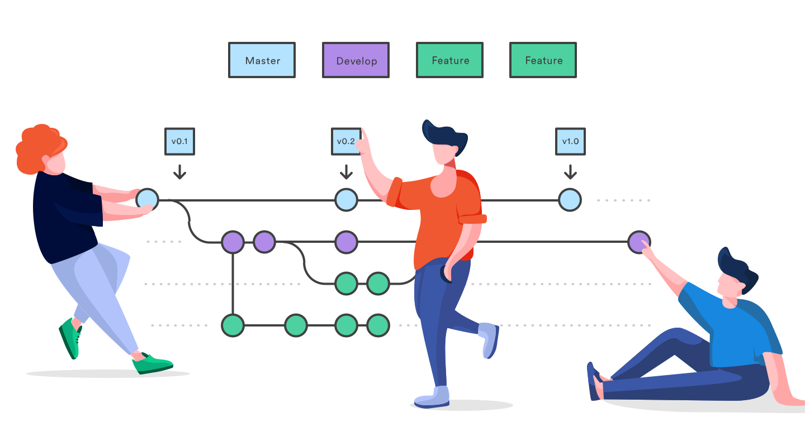

## Collection of tutorials regarding Git and Github Workflows!!

  

### Vedio-Tutorials

- [Code with Harry-Git Bash](https://youtu.be/gwWKnnCMQ5c)

- [Free-Code-Camp-Git-Tutorials](https://youtu.be/RGOj5yH7evk)

- [Learn Git in 15 min](https://youtu.be/USjZcfj8yxE)

### Learn Git by Visualization and Advanced Git Branching

- [Learn-Git-Branching](https://learngitbranching.js.org/)
